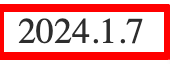

# DateText

# props
| Name (logical) | Name (physical) | Type | Require | Note |
| --- | --- | --- | --- | --- |
| date | date | Date | true | - |
| format | date formart | string | - | default: 'yyyy.m.d' option: 'yyyyMMdd' |

### Image
